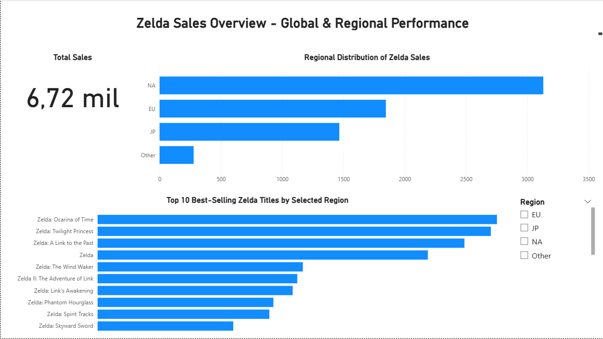
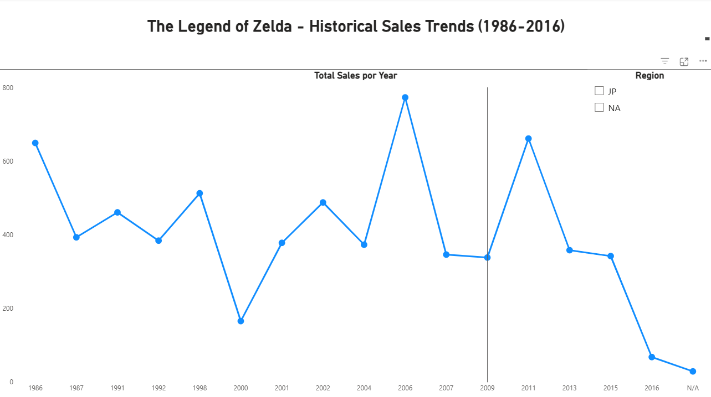
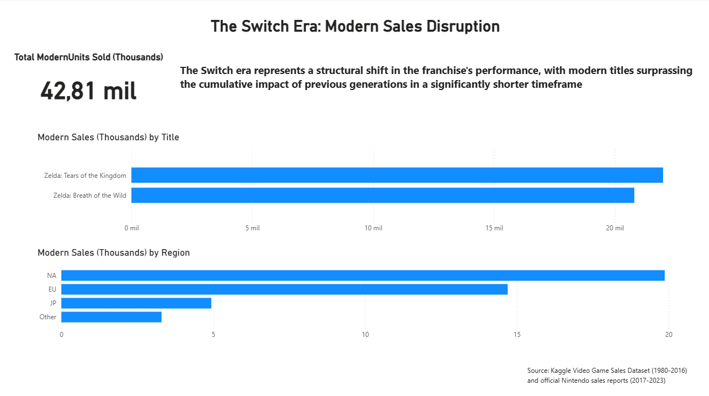

# The Legend of Zelda — Sales Analysis Dashboard

## Project Overview

This project analyzes historical and modern sales trends of *The Legend of Zelda* franchise using Power BI.

The dashboard explores long-term performance patterns from 1986 to 2016 and compares them with the commercial impact of modern titles released during the Nintendo Switch era.

The analysis highlights a structural shift in franchise performance, with recent titles achieving significantly higher sales in a shorter time period.

---

## Key Insights

* Modern titles generated over **42 million units sold**
* The Nintendo Switch era represents a major growth phase for the franchise
* North America is the leading market for modern Zelda titles
* Sales performance shows a clear structural shift compared to historical trends

---

## Dashboard Structure

### Page 1 — Franchise Sales Overview

### Page 2 — Historical Sales Trends (1986–2016)

### Page 3 — The Switch Era: Modern Sales Disruption

---

## Tools Used

* Power BI
* Power Query
* DAX
* Data Visualization
* Data Analysis

---

## Dataset Sources

* Kaggle Video Game Sales Dataset (1980–2016)
* Official Nintendo Sales Reports (2017–2023)

---

## Author

Darién Speranza
Data Analyst | Business Intelligence | Data Visualization
